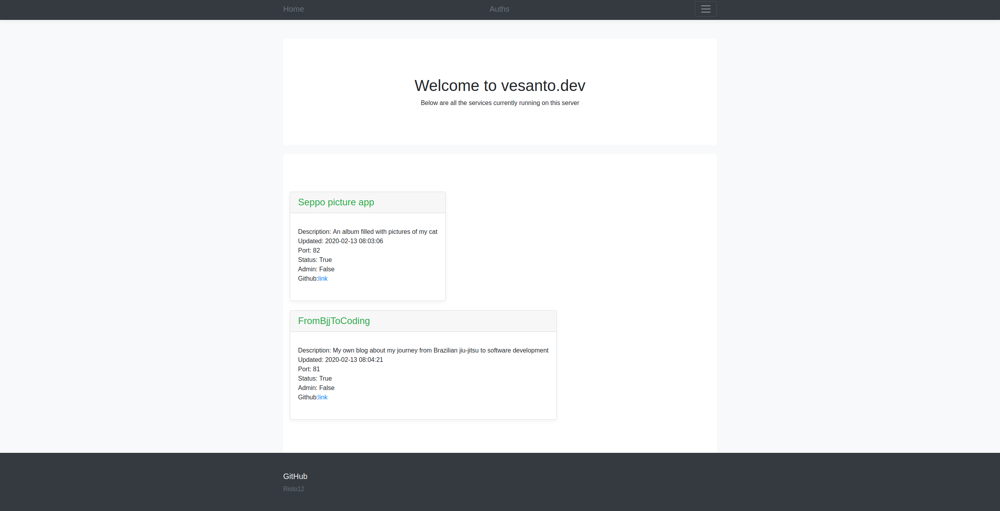
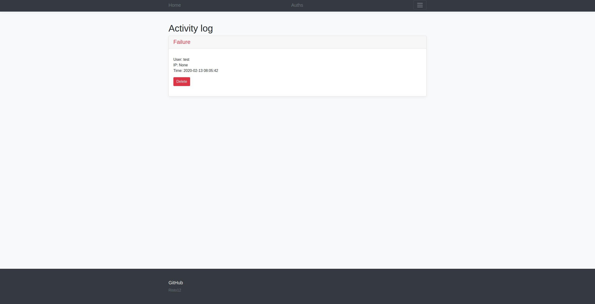

# Server controller

#### status:  Beta
### Running: vesanto.dev
### Description

This is the main page for my server which shows the running apps that are working on that server. It includes authentication show that admin has special features.

The page is made with Flask and uses SQL-database with sqlalchemy

